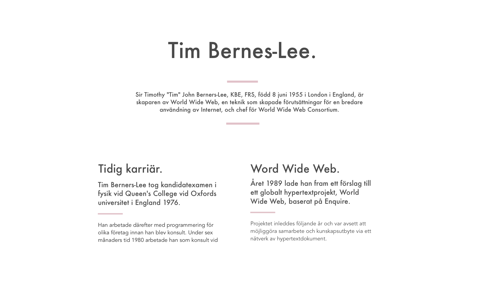

# Tim Bernes-Lee
## An assignment in the class visual communication - a typograph assignment

## Instructions
- You must only work with black + one color
- You are allowed use lines
- All text must be included on the site
- The target group is 25 year olds who are interested in programming
- It have to be a responsive web page
- Work with HTML and CSS

## How to make it Work
- Simply look at the GitHub-page

## Work schedule
- Designed the wireframes in Sketch
- Choose typefaces
- Choose colors
- Designer all UI in Sketch
- Build up the page using Bootstrap
